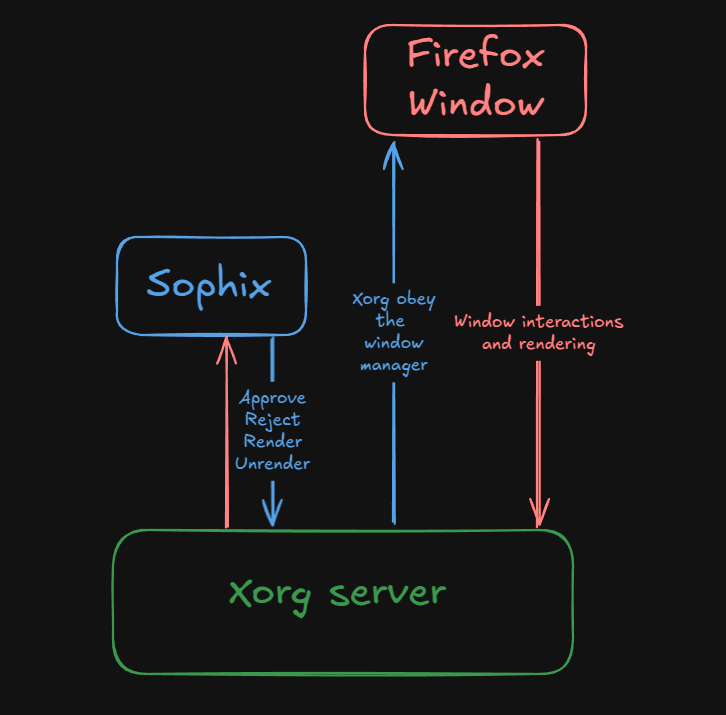

# Sophix
The idea behind sophix is to be a simple floating window manager. It's a project for me to learn a bit on how window managers, x11 programming works.

## How a window manager works?
Simplying as much as i can, everything rendered in your screen is handled by a X11 or Wayland server, the WM is the application who put the contents of the applications inside a window, and for that it act as a middlware between the X11 server and the applications, approving, rejecting, rendering and undering things in your screen. In the end, the window manager is the part of your interface who defines where and how things should appear xD

## Where can i learn more about that?
Once this is a learning purpose project, im definitly not an expert on window manager development, so you can learn more about those kind of applications reading the X11 docs or reading the book "Fundamentals of X Programming"